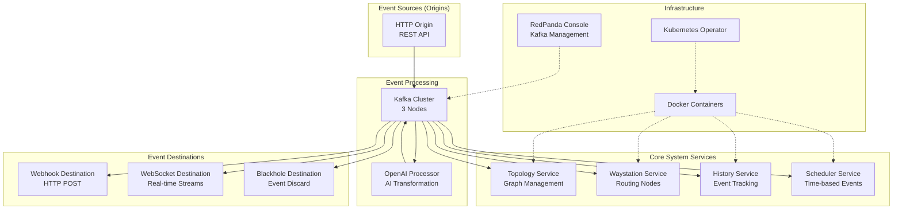
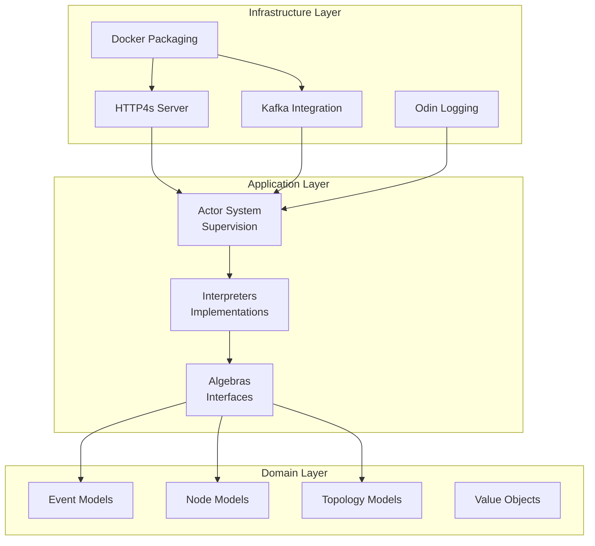
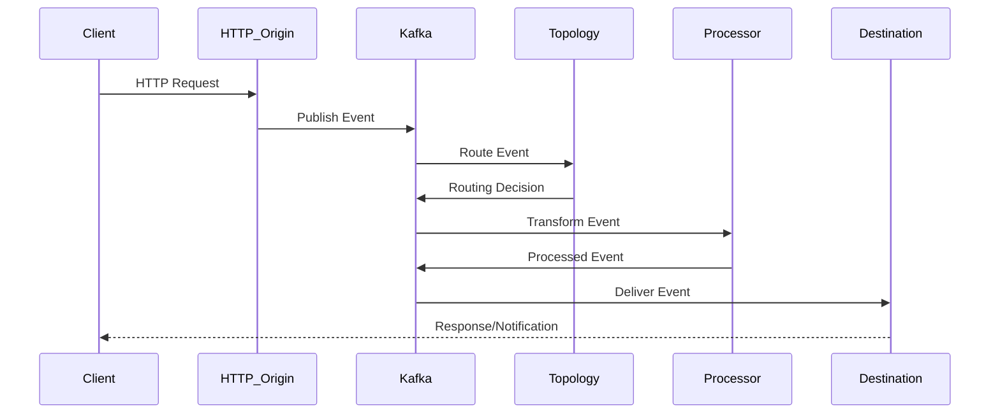
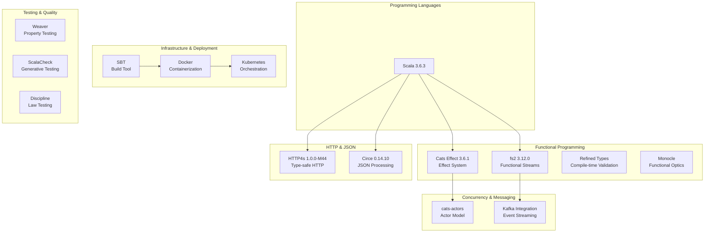
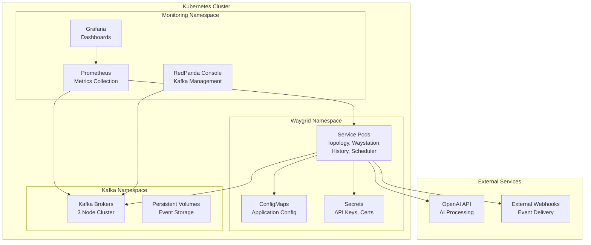

# Waygrid Router - Architecture Diagrams

## System Overview

## Component Architecture

## Event Flow Architecture

## Technology Stack

## Deployment Architecture

## Data Flow Patterns

```mermaid
graph LR
    subgraph "Input Processing"
        IN[Input Event]
        VALIDATE[Validation]
        PARSE[Parsing]
    end
    
    subgraph "Routing Engine"
        TOPOLOGY[Topology Graph]
        DECISION[Routing Decision]
        FILTER[Event Filtering]
    end
    
    subgraph "Processing Pipeline"
        TRANSFORM[Event Transform]
        ENRICH[Data Enrichment]
        AI[AI Processing]
    end
    
    subgraph "Output Delivery"
        FORMAT[Output Formatting]
        DELIVERY[Delivery Method]
        CONFIRM[Confirmation]
    end
    
    IN --> VALIDATE
    VALIDATE --> PARSE
    PARSE --> TOPOLOGY
    TOPOLOGY --> DECISION
    DECISION --> FILTER
    FILTER --> TRANSFORM
    TRANSFORM --> ENRICH
    ENRICH --> AI
    AI --> FORMAT
    FORMAT --> DELIVERY
    DELIVERY --> CONFIRM
```

This architecture demonstrates a modern, scalable, and maintainable event-driven system built with functional programming principles and industry best practices.